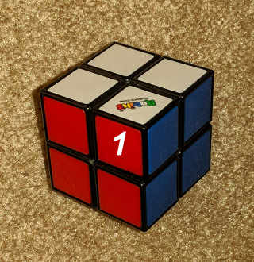
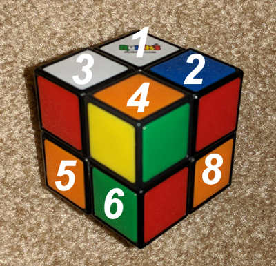

Finds the shortest (optimal) solution to the 2x2x2 equivalent of Rubik’s cube (Nickols cube, Pocket cube) using iterative deepening A* graph search with branch pruning. Solves the most complex states (depth 11) in a few seconds on macbook pro.
https://en.wikipedia.org/wiki/Pocket_Cube  

Some code snippets were borrowed from this repo:
https://github.com/aimacode/aima-python  

Usage:  
download or clone this repo, open a terminal/command window and run the line below  

To use the Manhattand distance heuristic:    
python cubeH.py  
  
To generate and use the (~140M, depth 9) pattern database heuristic:    
python cubeDB.py  
  
References:   
http://www.aaai.org/Papers/AAAI/1997/AAAI97-109.pdf     
  
Written in Python 3.x  

Cubie 1:  
    

Numbering of the cubies in the program:  
